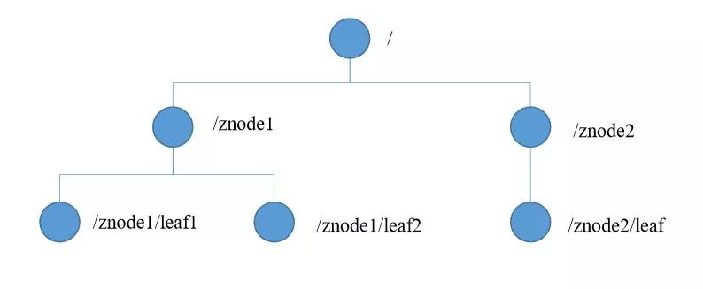

# 分布式锁

## redis/zk分布式锁区别
* 技术层面：Redis 是nosql数据，而Zookeeper是分布式协调工具，主要用于分布式解决方案；
* 防死锁：Redis是通过对key设置有效期来解决死锁，而Zookeeper使用会话有效期方式解决死锁现象；
* 效率方面：Redis是NoSQL数据库，在效率上相对来说Redis就要比Zookeeper好很多；
* 可靠性：Redis有效期不是很好控制，可能会产生有效期延迟，而Zookeeper的临时节点有先天性可控的有效期，所以相对来说Zookeeper比Redis可靠性高；

## zookeeper
    ZooKeeper是一个分布式的，开放源码的分布式应用程序协调服务，是Google的Chubby一个开源的实现，是Hadoop和Hbase的重要组件。它是一个为分布式应用提供一致性服务的软件，提供的功能包括：配置维护、域名服务、分布式同步、组服务等。  
    ZooKeeper的目标就是封装好复杂易出错的关键服务，将简单易用的接口和性能高效、功能稳定的系统提供给用户。  
    ZooKeeper包含一个简单的原语集，提供Java和C的接口。  
    ZooKeeper代码版本中，提供了分布式独享锁、选举、队列的接口，代码在$zookeeper_home\src\recipes。其中分布锁和队列有Java和C两个版本，选举只有Java版本。
### 节点
节点是zookeeper（zk）中数据存储的基础结构，zk中万物皆节点，就好比Java中万物皆对象一样。zk的数据模型就是基于节点的树形结构，但zk规定每个节点的引用规则是路径引用。  
节点结构：  
* 子节点引用
* 存储数据
* 访问权限
* 节点元数据
 
 
节点类型：  
* 持久节点：节点创建后，就一直存在，直到有删除操作来主动清除。
* 顺序节点：假如当前有一个父节点为/lock，我们可以在这个父节点下面创建子节点；zk提供了一个可选的有序特性，例如我们可以创建子节点“/lock/test_”并且指明有序，那么zk在生成子节点时会根据当前子节点数量自动添加整数序号，如果第一个子节点为/lock/test_0000000000，下一个节点则为/lock/test_0000000001，依次类推。
* 临时节点：客户端可以建立一个临时节点，在会话结束或者会话超时后，zookeeper会自动删除该节点。

## curator
    Curator就是Netflix开源的一套ZooKeeper客户端框架，它提供了zk场景的绝大部分实现，使用Curator就不必关心其内部算法，Curator提供了来实现分布式锁，用方法获取锁，以及用方法释放锁，同其他锁一样，方法需要放在finakky代码块中，确保锁能正确释放  

Curator提供了四种分布式锁，分别是：  
  
* InterProcessMutex：分布式可重入排它锁
* InterProcessSemaphoreMutex：分布式排它锁
* InterProcessReadWriteLock：分布式读写锁
* InterProcessMultiLock：将多个锁作为单个实体管理的容器